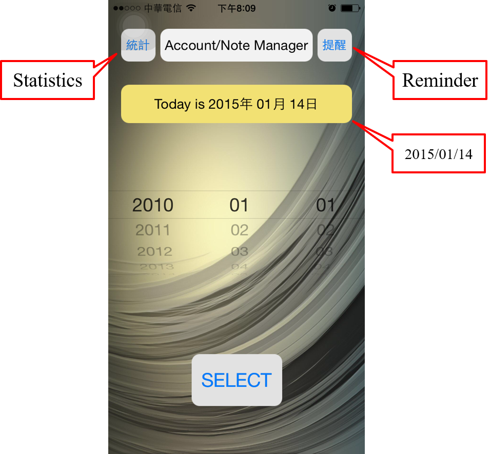
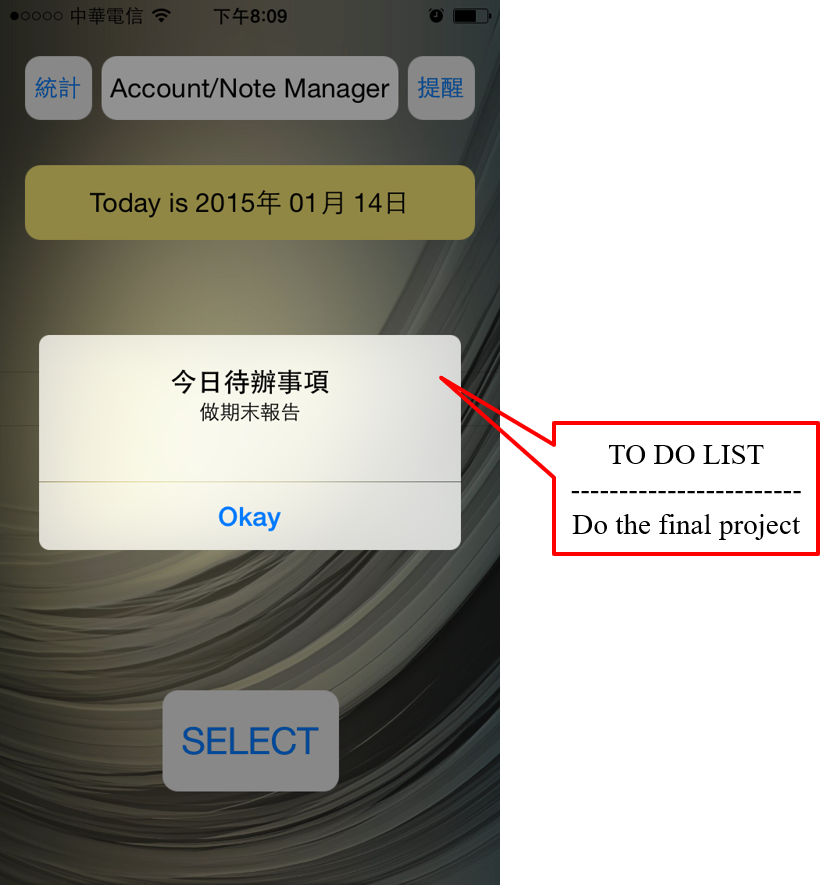
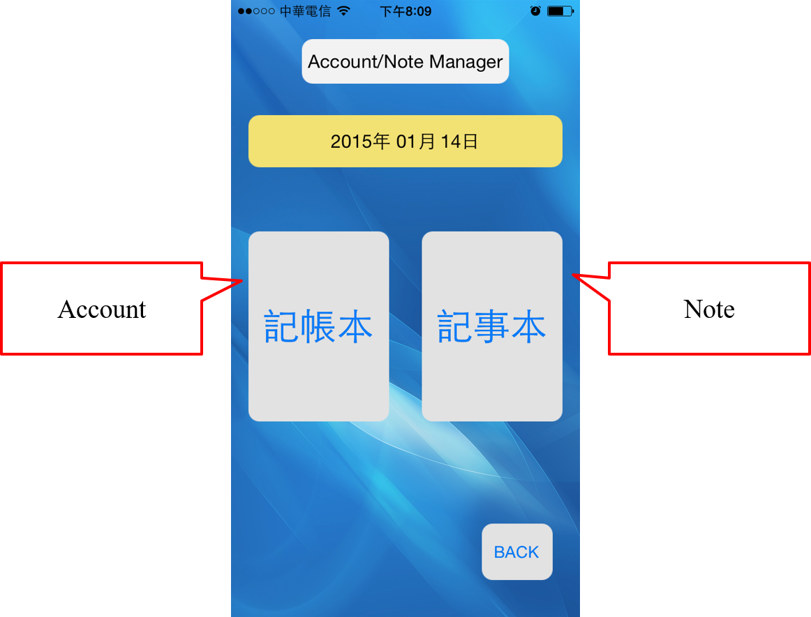
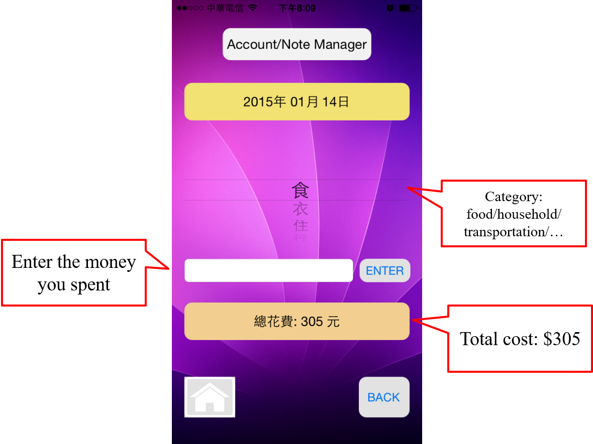
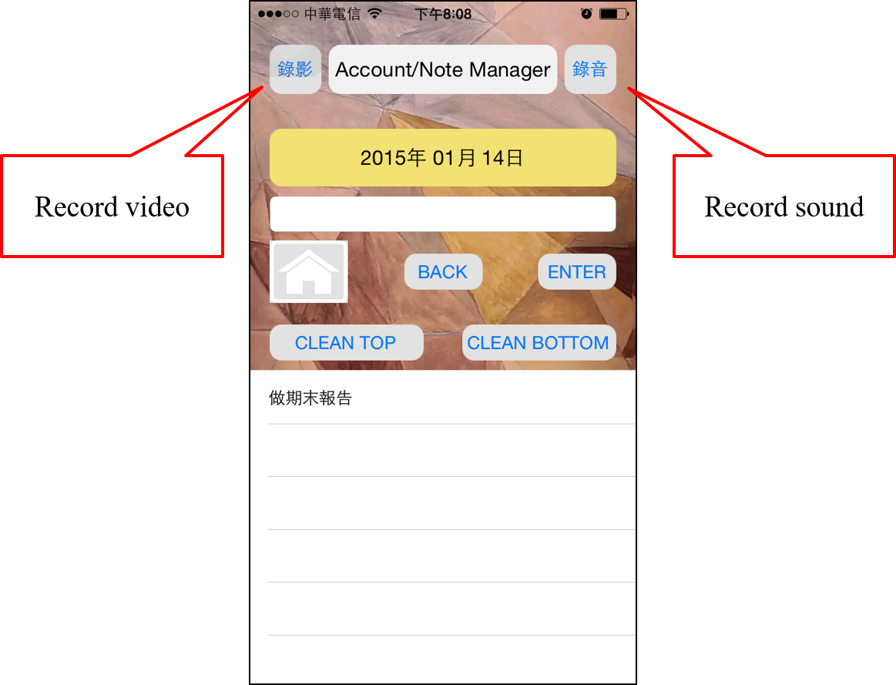
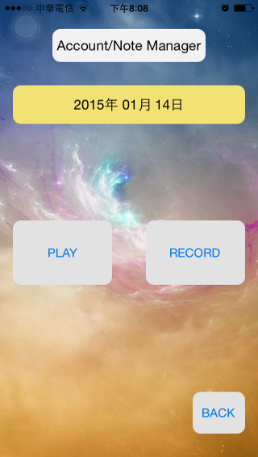
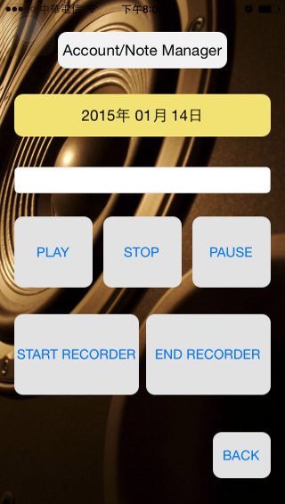

# Account-and-Note-Manager
My First iOS app. 
This app provides users to record their to-do items and expense.

## Getting Started

### Prerequisites

Install Xcode on your system.

### Installing

Import the project and start the simulation.

## Screenshots
- Home page

The page that the user will first see when entering this app.
{:height="50%" width="50%"}

- Reminder page

Once, the user clicks the "Reminder" button in home page, the to-do list of current date shows up.
{:height="50%" width="50%"}

- Statistics page

Once, the user clicks the "Statistics" button in home page, he/she can check the expense of specific time and category.
{:height="50%" width="50%"}

- Selection page

Once, the user picks a date and clicks the "Selection" button in home page, he/she can decide to add expense records or manage the to-do list.
{:height="50%" width="50%"}

- Account page

Once, the user clicks the "Account" button in selection page, he/she can check the expense of specific category.
{:height="50%" width="50%"} 

- Note page

Once, the user clicks the "Note" button in selection page, he/she can upate the to-do list.
{:height="50%" width="50%"}

- Player page (video)

This app provides user to record a video as a reminder.
{:height="50%" width="50%"}

- Player page (sound)

Also, users are available to save the reminder as an audio file.
{:height="50%" width="50%"}

## Appendix